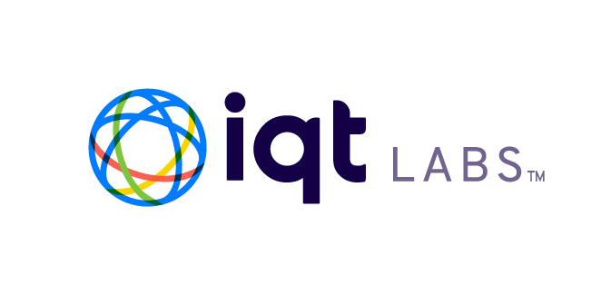

<a name="readme-top"></a>

[contributors-shield]: https://img.shields.io/github/contributors/IQTLabs/edgetech-core.svg?style=for-the-badge
[contributors-url]: https://github.com/IQTLabs/edgetech-core/graphs/contributors
[forks-shield]: https://img.shields.io/github/forks/IQTLabs/edgetech-core.svg?style=for-the-badge
[forks-url]: https://github.com/IQTLabs/edgetech-core/network/members
[stars-shield]: https://img.shields.io/github/stars/IQTLabs/edgetech-core.svg?style=for-the-badge
[stars-url]: https://github.com/IQTLabs/edgetech-core/stargazers
[issues-shield]: https://img.shields.io/github/issues/IQTLabs/edgetech-core.svg?style=for-the-badge
[issues-url]: https://github.com/IQTLabs/edgetech-core/issues
[license-shield]: https://img.shields.io/github/license/IQTLabs/edgetech-core.svg?style=for-the-badge
[license-url]: https://github.com/IQTLabs/edgetech-core/blob/master/LICENSE.txt
[product-screenshot]: images/screenshot.png

[Python]: https://img.shields.io/badge/python-000000?style=for-the-badge&logo=python
[Python-url]: https://www.python.org
[Poetry]: https://img.shields.io/badge/poetry-20232A?style=for-the-badge&logo=poetry
[Poetry-url]: https://python-poetry.org
[Docker]: https://img.shields.io/badge/docker-35495E?style=for-the-badge&logo=docker
[Docker-url]: https://www.docker.com

[![Contributors][contributors-shield]][contributors-url]
[![Forks][forks-shield]][forks-url]
[![Stargazers][stars-shield]][stars-url]
[![Issues][issues-shield]][issues-url]
[![MIT License][license-shield]][license-url]

<br />
<div align="center">
  <a href="https://iqtlabs.org/">
    
  </a>

<h1 align="center">EdgeTech-Core</h1>

  <p align="center">
    EdgeTech-Core is a unified platform bringing functionality to edge-based devices with minimal development effort. The core is a dynamic message/event-based infrastructure that is enabled via <a href="https://projects.eclipse.org/projects/iot.mosquitto">MQTT</a>. All of this functionality is wrapped in a Docker containers for cross-platform compatability. Using the containers built on EdgeTech-Core, defining the software stack of an edge-deployable device should be as easy as dropping those containers into your docker-compose file and tuning enviornment variables to fit your needs. If you don't find that, come help us make it better by contributing!
    <br/>
    <br/>
    <h2 align="left">
    Core Services:
    </h2>
    <p align="left">
    - MQTT Broker (this module is dependent on the [eclipse-mosquitto](https://hub.docker.com/_/eclipse-mosquitto) docker contianer running and uses [mqtt-paho](https://www.eclipse.org/paho/index.php?page=clients/python/index.php) to interact with this broker)
    <br/>
    - Heartbeat Monitor (keep the TCP/IP connection with the MQTT broker alive)
    <br/>
    - Core Library (python library for interacting with MQTT e.g. adding publishers/subscribers, connecting, disconnecting, etc.)
    <br/>
    </p>
    <br/>
    <h2 align="left">
    Auxiliary Services:
    </h2>
    <p align="left">
    - <a href="https://github.com/IQTLabs/edgetech-daisy">edgetech-daisy</a>
    <br/>
    - <a href="https://github.com/IQTLabs/edgetech-filesaver">edgetech-filesaver</a>
    <br/>
    - <a href="https://github.com/IQTLabs/edgetech-audio-recorder">edgetech-audio-recorder</a>
    <br/>
    - <a href="https://github.com/IQTLabs/edgetech-c2">edgetech-c2</a>
    <br/>
    - <a href="https://github.com/IQTLabs/edgetech-telemetry-pinephone">edgetech-telemetry-pinephone</a>
    <br/>
    - <a href="https://github.com/IQTLabs/edgetech-s3-uploader">edgetech-s3-uploader</a>
    <br/>
    - <a href="https://github.com/IQTLabs/edgetech-couchdb-startup">edgetech-couchdb-startup</a>
    <br/>
    - <a href="https://github.com/IQTLabs/edgetech-couchdb-saver">edgetech-couchdb-saver</a>
    <br/>
    - <a href="https://github.com/IQTLabs/edgetech-http-uploader">edgetech-http-uploader</a>
    <br/>
    </p>
    <br/>
    <br/>
    <h2 align="left">
    Projects that use Core:
    </h2>
    <p align="left">
    - <a href="https://github.com/IQTLabs/aisonobuoy-collector-pinephone">aisonobuoy-collector-pinephone</a>
    </p>
    <br/>
    <br/>
    <a href="https://github.com/IQTLabs/edgetech-core/pulls">Make Contribution</a>
    ·
    <a href="https://github.com/IQTLabs/edgetech-core/issues">Report Bug</a>
    ·
    <a href="https://github.com/IQTLabs/edgetech-core/issues">Request Feature</a>
  </p>
</div>

### Built With

[![Python][Python]][Python-url]
[![Poetry][Poetry]][Poetry-url]
[![Docker][Docker]][Docker-url]

## Getting Started

To run this repo, simply run:

```
docker-compose up
```

The filesaver is containerized and dependencies are managed using [poetry]("https://python-poetry.org"). 

### Prerequisites

Running this repo requires that you have [Docker](https://www.docker.com) installed. 

## Usage

Spinning up this system requires an MQTT server and this container to be included in your `docker-compose.yml`. You can find an example of this workflow in this repository's `docker-compose.yml`. Additionally, some editing of relevant enviornment variables will be required based upon your system's configuration of topics to subscribe to and MQTT configuration. Examples of these enviornment variables can be found in this repository's `.env` file. 

As this system is meant to be spun up with MQTT topics you would like to write to files, copying the filesaver `docker-compose` statements into a master `docker-compose.yml` and  `.env` files with your entire system of containers is the preferred workflow.

### Container Options via Watchtower

Image tags for desired services can be set using the `SERVICES_VERSION` environment variable. Current images are published using tags `latest`, `stable`, and `production` for the latest image updates, last stable image updates, and production/deployment-ready images respectively. 

## EdgeTech Core Tests

### Running
`cd` into directory with `docker-compose.yaml`, add a line: `CMD pytest BaseMQTTPubSubTest.py` and then run: `docker-compose up --build`.

## Roadmap

- TBA

See the [open issues](https://github.com/github_username/repo_name/issues) for a full list of proposed features (and known issues).

## Contributing

1. Fork the Project
2. Create your Feature Branch (`git checkout -b dev`)
3. Commit your Changes (`git commit -m 'adding some feature'`)
4. Run (and make sure they pass):
```
black --diff --check *.py

pylint --disable=all --enable=unused-import *.py

mypy --allow-untyped-decorators --ignore-missing-imports --no-warn-return-any --strict --allow-subclassing-any *.py
```
If you do not have them installed, you can install them with `pip install "black<23" pylint==v3.0.0a3 mypy==v0.991`.

5. Push to the Branch (`git push origin dev`)
6. Open a Pull Request

See `CONTRIBUTING.md` for more information.

## License

Distributed under the [Apache 2.0](https://github.com/IQTLabs/edgetech-filesaver/blob/main/LICENSE). See `LICENSE.txt` for more information.

## Contact IQTLabs

  - Twtiter: [@iqtlabs](https://twitter.com/iqtlabs)
  - Email: info@iqtlabs.org

See our other projects: [https://github.com/IQTLabs/](https://github.com/IQTLabs/)

<p align="right">(<a href="#readme-top">back to top</a>)</p>
